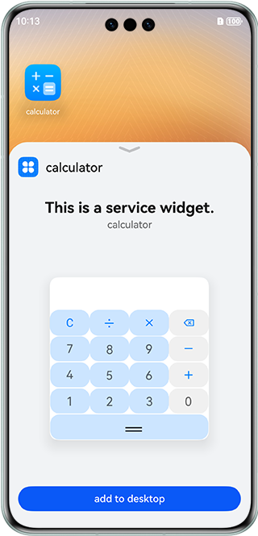

# ArkTS Widget Calculator

### Overview

This sample shows how to develop a calculator model using the ArkTS widgets.

### Preview

| Adding a widget                                            | Preview the widget                                                   | Operating the widget                                            |
|--------------------------------------------------|---------------------------------------------------------|--------------------------------------------------|
|  |  |  |

### How to Use

1. Touch and hold an app icon to add it to the home screen.

2. Perform calculation on the widget.

### Project Directory

```
├──entry/src/main/ets                        // Code area
│  ├──calc/pages
│  │  └──CardCalc.ets                        // Calculator widget page
│  ├──entryability
│  │  └──EntryAbility.ets  
│  ├──entryability
│  │  └──EntryFormAbility.ets                 // File for periodically processing the widget declaration
│  ├──model
│  │  └──Logger.ts                            // Log file
│  └──pages
│     └──index.ets                            // Home page
├──entry/src/main/resources                   // App resource directory
└──module.json5                               // Add the widget extension capability
```

### Required Permissions

N/A

### Constraints

1. The sample is only supported on Huawei phones with standard systems.
2. The HarmonyOS version must be HarmonyOS 5.0.5 Release or later.
3. The DevEco Studio version must be DevEco Studio 5.0.5 Release or later.
4. The HarmonyOS SDK version must be HarmonyOS 5.0.5 Release SDK or later.
