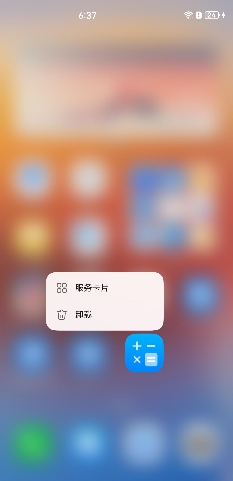
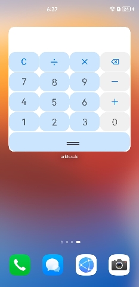

# ArkTS卡片计算器

### 介绍

本示例展示了使用ArkTS卡片开发的计算器模型。

### 效果预览

| 添加卡片                                             | 卡片预览                                                    | 操作卡片                                             |
|--------------------------------------------------|---------------------------------------------------------|--------------------------------------------------|
|  |  |  |

### 使用说明

1.长按应用图标，将卡片添加到桌面。

2.对桌面上的卡片进行计算操作。

### 工程目录

```
├──entry/src/main/ets                         // 代码区
│  ├──calc
│  │  └──pages
│  │     └──CardCalc.ets                      // 计算器卡片页面
│  ├──entryability
│  │  └──EntryAbility.ets  
│  ├──entryability
│  │  └──EntryFormAbility.ets                 // 卡片声明周期处理文件
│  ├──model
│  │  └──Logger.ts                            // 日志文件
│  └──pages
│     └──index.ets                            // 首页
└──entry/src/main/resources                   // 应用资源目录

```

### 相关权限

不涉及。

### 约束与限制

1.本示例仅支持标准系统上运行，支持设备：华为手机。

2.HarmonyOS系统：HarmonyOS NEXT Developer Beta1及以上。

3.DevEco Studio版本：DevEco Studio NEXT Developer Beta1及以上。

4.HarmonyOS SDK版本：HarmonyOS NEXT Developer Beta1 SDK及以上。